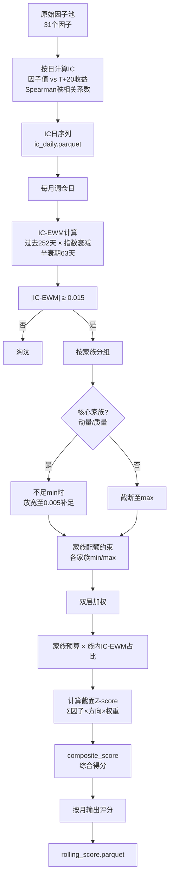
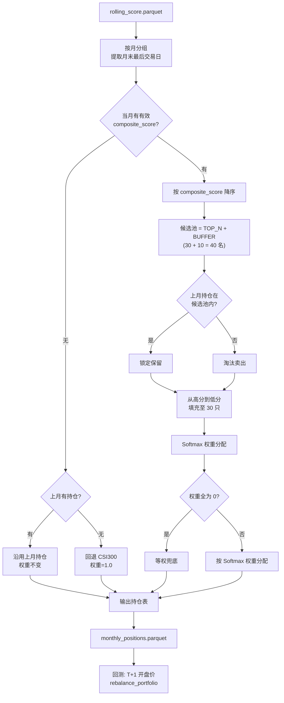
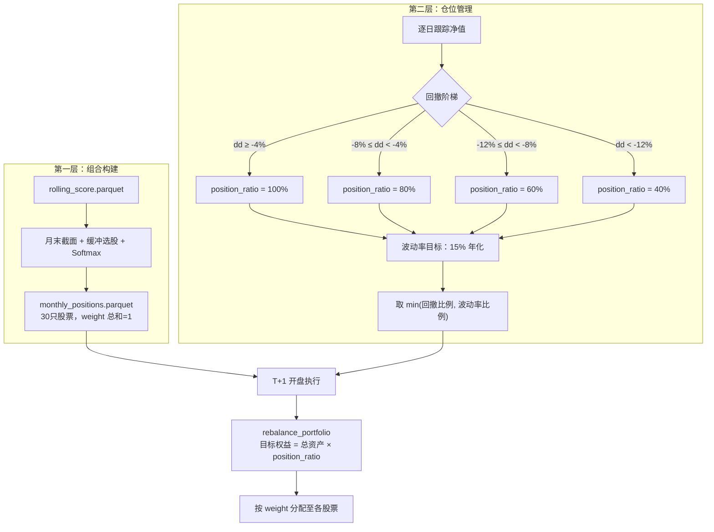

# 🧬 动态多因子选股回测系统

基于 **Tushare Pro** 数据的 **沪深300 动态多因子月度调仓策略**，覆盖 **2018-01-02 ~ 2026-06-30**，实现从数据获取 → 因子计算 → 动态因子筛选 → 选股 → 回测的全流程自动化。

---

## 📊 回测绩效

> 回测采用**样本内（2018-02 ~ 2023-12）/ 样本外（2024-02 ~ 2026-06）**双阶段验证，
> 其中 2018 年仅有 2 月起约 11 个月数据，2026 年为 H1 半年数据。

### 样本内：2018-02 ~ 2023-12（~5.9年）

| 指标 | 数值 |
|------|------|
| 回测区间 | 2018-02-01 ~ 2023-12-29 |
| 累计收益率 | **+397.31%** |
| 年化收益率 | **31.21%** |
| 年化波动率 | 19.17% |
| 夏普比率 | **1.52** |
| 最大回撤 | **-16.59%** |
| 胜率（月度） | 53.59% |
| 超额收益（vs 沪深300） | **+416.50%** |
| 信息比率 | 1.95 |

### 样本外：2024-02 ~ 2026-06（~2.4年）

| 指标 | 数值 |
|------|------|
| 回测区间 | 2024-02-01 ~ 2026-06-30 |
| 累计收益率 | **+318.25%** |
| 年化收益率 | **81.11%** |
| 年化波动率 | 22.83% |
| 夏普比率 | **3.47** |
| 最大回撤 | **-10.67%** |
| 胜率（月度） | 56.99% |
| 超额收益（vs 沪深300） | **+263.50%** |
| 信息比率 | 2.91 |

### 分年收益 vs 沪深300

#### 样本内

| 年份 | 策略收益 | 沪深300 | 超额收益 |
|------|---------|---------|---------|
| 2018 | +0.58% | -26.34% | **+26.93%** |
| 2019 | +42.70% | +37.95% | +4.75% |
| 2020 | +94.32% | +25.51% | **+68.81%** |
| 2021 | +73.29% | -6.21% | **+79.50%** |
| 2022 | -6.82% | -21.27% | **+14.45%** |
| 2023 | +8.89% | -11.75% | **+20.64%** |

#### 样本外

| 年份 | 策略收益 | 沪深300 | 超额收益 |
|------|---------|---------|---------|
| 2024 | +56.09% | +16.20% | **+39.89%** |
| 2025 | **+91.09%** | +21.19% | **+69.90%** |
| 2026(H1) | +36.23% | +5.55% | +30.69% |

> **关键发现**：
> - 策略在 8.5 年中**每年均跑赢**沪深300，无一年负超额
> - 2021-2023 年沪深300连续三年下跌，策略在 2021（+73.29%）和 2023（+8.89%）保持正收益，仅 2022 微亏 -6.82%，但仍跑赢沪深300 14.45% 
> - 样本外夏普比率 3.47 远超样本内 1.52，说明 2024-2026 牛市中策略的因子筛选机制有效放大了进攻能力
> - 样本内最大回撤 -16.59%（2018年），样本外仅 -10.67%，回撤控制在可接受范围内

> ⚠️ **业绩归因与风险提示**：
> - 样本外区间（2024-2026）为A股结构性牛市，策略收益部分受益于市场Beta，超额收益中动量/小市值因子暴露显著。
> - 本回测假设以开盘价/收盘价即时成交，未考虑实盘中的冲击成本、涨跌停及停牌复牌跳空。
> - 策略参数基于历史数据（2018-2023）拟合，未来市场风格切换可能导致失效。
> - **本项目为量化研究学习用途，不构成任何投资建议。**

---

## 🏗️ 整体架构流程

```mermaid
graph TD
    subgraph A[数据层]
        A1[原始数据<br>Tushare Pro] --> A2[清洗对齐<br>stock_merged_clean.parquet<br>日线+估值+财务]
    end

    subgraph B[因子生成层<br>FactorCalculator]
        A2 --> B1[技术因子<br>动量/波动率/回撤/换手率]
        A2 --> B2[估值因子<br>PE/PB/PS/总市值]
        A2 --> B3[财务因子<br>ROE/毛利率/净利润增速<br>ROE同比变化/资产负债率]
        A2 --> B4[情绪因子<br>量比/成交量变化率]
        B1 & B2 & B3 & B4 --> B5[预处理管线<br>①缺失值填充 ②缩尾截断 ③Z-score标准化]
        B5 --> B6[all_factors.parquet<br>31个标准化因子]
    end

    subgraph C[动态筛选层<br>因子建模动态筛选构建.py]
        B6 --> C1[IC计算<br>因子值 vs T+20收益<br>Spearman秩相关系数]
        C1 --> C2[IC-EWM平滑<br>半衰期63天]
        C2 --> C3[四步筛选<br>①|IC-EWM|过滤 ②家族配额<br>③双层加权 ④零因子兜底]
        C3 --> C4[rolling_score.parquet<br>每月综合得分]
    end

    subgraph D[组合构建层<br>选股+权重.py]
        C4 --> D1[月末调仓日提取]
        D1 --> D2[缓冲选股<br>TOP30 + 10缓冲]
        D2 --> D3[Softmax权重分配]
        D3 --> D4[monthly_positions.parquet<br>30只目标持仓+权重]
    end

    subgraph E[回测执行层<br>回测.py]
        D4 --> E1[T+1开盘价成交]
        E1 --> E2[rebalance_portfolio<br>按权重统一再平衡]
        E2 --> E3[动态仓位管理<br>回撤阶梯 + 波动率目标]
        E3 --> E4[绩效输出<br>净值曲线/夏普/回撤/超额]
    end
```

---

## 1️⃣ 数据获取与清洗

### 数据获取（`数据获取.py`）

通过 **Tushare Pro API** 获取数据，整体时间范围 **2018-01-02 ~ 2026-06-30**，按样本内/样本外拆分：

| 阶段 | 时间范围 | 用途 |
|------|---------|------|
| 样本内 | 2018-01 ~ 2023-12 | 因子筛选参数拟合 |
| 样本外 | 2024-01 ~ 2026-06 | 独立验证 |

| API | 内容 | 关键字段 | 备注 |
|-----|------|---------|------|
| `pro.daily` | 日线行情 | open, high, low, close, volume, amount, pct_chg | `adj='qfq'` 前复权 |
| `pro.daily_basic` | 每日估值 | total_mv, float_share, pe_ttm, pb, ps_ttm, turnover_rate | — |
| `pro.fina_indicator` | 季度财务 | roe, netprofit_yoy, grossprofit_margin, debt_to_assets | 不限日期，获取全部历史季报 |
| `pro.index_daily` | 沪深300指数 | index_close | 用于超额收益计算 |

- 逐只股票请求，间隔 `sleep(0.6s)` 防止限流
- `pct_chg` 获取阶段即除以 100 转为小数

### 数据清洗（`数据清洗.py`）

三表统一清洗（去重 → 空值删除 → 类型转换 → 按 symbol/date 排序），核心额外处理：

| 数据表 | 关键操作 |
|--------|---------|
| 日线 | 前复权修正、剔除交易天数 < 60 的次新股、`daily_return = close.pct_change()` |
| 估值 | 删除 `pe_ttm/pb/total_mv` 缺失行 |
| 财务 | 季度频次，按报告期去重 |

### 数据合并（`merge_and_align_data()`）

```
日线 + 估值 → merge(on=['symbol','date'], how='left')
     + 财务 → groupby('symbol').apply(merge_asof(direction='backward'))
```

财务数据（季度频次）通过 `merge_asof(backward)` 前向填充到每日，**严格无未来函数**：2021Q1 报告期（3-31）数据覆盖 4-1 ~ 6-29 的交易日，直到 Q2 报告期覆盖。`forward_return = daily_return.shift(-20)` 在 IC-IR 计算阶段单独构建。

### 创建因子池（`创建因子池.py`）

#### 因子预处理三步流程

所有因子计算完毕后，统一执行以下处理管线，确保因子质量：

```
原始因子值 → ① 缺失值填充 → ② 缩尾处理 → ③ Z-score 标准化 → 输出
```

| 步骤 | 方法 | 实现 | 作用 |
|------|------|------|------|
| ① 缺失值填充 | `fillna_method='mean'` | 按日期分组，用当日全市场均值填充 NaN | 财务因子为季度频次，日频匹配不到时用中性值填补；`'median'` 更鲁棒，`'ffill'` 适合前向填充 |
| ② 缩尾处理 | `winsorize_quantile=0.99` | 按日期分组，截断到 [P1, P99] 分位数 | 消除极端异常值（如 PE=10000、ROE=500%），防止一两个异常值拉偏全市场 Z-score |
| ③ Z-score 标准化 | `apply_standardize=True` | 按日期分组：$z_i = \frac{x_i - \mu_{date}}{\sigma_{date}}$ | 统一不同量纲因子到同一尺度，使动量、PE、ROE 等可以加权合成综合得分 |

> **执行顺序不可颠倒**：先填后缩再标准化。若先缩尾再填充，会用均值覆盖已被截断的正常值；若先标准化再缩尾，标准化后的 z-score 缩尾无意义。

---

#### 技术因子（20 个）— `_compute_momentum / _compute_volatility / _compute_turnover / _compute_max_drawdown`

| 因子名 | 公式 | 窗口 | 方向 | 说明 |
|--------|------|------|------|------|
| `momentum_N` | `close.pct_change(N)` | 5/10/20/60/120/240 | 正向 | 多周期价格动量，含年线趋势 |
| `volatility_N` | `daily_return.rolling(N).std() × √252` | 5/10/20/60/120/240 | 负向 | 年化波动率，低波动异象 |
| `max_drawdown_N` | `(close / rolling_max(close,N) - 1).min()` | 5/10/20/60/120/240 | 负向 | 过去 N 日最大回撤，控制尾部风险 |
| `turnover_rate` | `volume / float_share` | — | 负向 | 当日换手率，低换手表示筹码稳定 |
| `avg_turnover_20` | `turnover_rate.rolling(20).mean()` | 20 日均 | 负向 | 20 日均换手率，平滑短期波动 |


---

#### 估值因子（4 个）— `_compute_valuation`

| 因子名 | 数据源 | 方向 | 说明 |
|--------|--------|------|------|
| `pe_ttm` | Tushare `daily_basic` | 负向 | 滚动市盈率，低估值安全边际 |
| `pb` | Tushare `daily_basic` | 负向 | 市净率，跌破净资产时 PB<1 |
| `ps_ttm` | Tushare `daily_basic` | 负向 | 市销率，适用于盈利不稳定的成长股 |
| `total_mv` | Tushare `daily_basic` | 负向 | 总市值取负，小市值效应（市值越小得分越高） |

> 无限值（`±inf`）替换为 NaN，后续由缺失值填充步骤统一处理。

---

#### 财务因子（5 个）— `_compute_financial`

| 因子名 | 数据源/公式 | 方向 | 说明 |
|--------|------------|------|------|
| `roe` | Tushare `fina_indicator` | 正向 | 净资产收益率（ROE），巴菲特核心指标 |
| `grossprofit_margin` | Tushare `fina_indicator` | 正向 | 毛利率，反映定价权与护城河 |
| `netprofit_yoy` | Tushare `fina_indicator` | 正向 | 净利润同比增速，盈利成长性 |
| `roe_yoy_change` | `roe - roe.shift(4)` | 正向 | ROE 同比变化，捕捉业绩加速/减速趋势 |
| `debt_to_assets` | Tushare `fina_indicator` | 负向 | 资产负债率，剔除高杠杆标的 |

> `roe_yoy_change` 为自定义衍生因子：按 `symbol` 分组计算 ROE 同比差值（shift(4) 对应季度数据中去年同期），用于识别「ROE 正在提升」的加速度信号。

---

#### 情绪因子（2 个）— `_compute_sentiment`

| 因子名 | 公式 | 方向 | 说明 |
|--------|------|------|------|
| `volume_change_ratio` | `vol_ma5 / vol_ma20 - 1` | 双向 | 量能变化：正值放量、负值缩量，捕捉量价背离 |
| `volume_ratio` | `vol / vol_ma5` | 双向 | 当日量比，>1 表示放量、<1 表示缩量 |

---

### 动态筛选因子（`IC-IR计算.py` + `因子建模动态筛选构建.py`）

采用 **IC-EWM 指数衰减 + 家族配额 + 双层加权**，逐月自适应市场风格。



**核心逻辑**

| 环节 | 方法 | 关键参数 |
|------|------|---------|
| IC 计算 | **Spearman 秩相关**（因子值 vs T+20 收益） | 对异常值稳健 |
| IC 平滑 | **指数衰减加权（EWM）** | 半衰期 63 天 |
| 基础过滤 | `|IC-EWM| ≥ 0.015` | 剔除弱信号 |
| 家族配额 | 各家族 min/max 硬约束 | 防单一风格垄断 |
| 核心兜底 | 动量/质量族放宽至 0.005 | 保核心 Alpha |
| 权重分配 | 家族预算 × 族内 IC-EWM 占比 | 顶层控暴露 |

**家族配额与预算**

| 家族 | 关键词 | min/max | 预算 |
|------|--------|---------|------|
| 动量 | `momentum_`, `change` | 2~4 | 20% |
| 质量 | `roe`, `grossprofit_margin`, `netprofit_yoy` | 1~5 | 25% |
| 回撤 | `max_drawdown_` | 0~2 | 20% |
| 波动率 | `volatility_` | 0~2 | 10% |
| 流动性 | `turnover_rate`, `avg_turnover_`, `amount_billion`, `total_mv` | 0~3 | 10% |
| 估值 | `pe_ttm`, `pb`, `ps_ttm` | 0~3 | 5% |
| 技术 | `pre_close`, `volume_ratio` | 0~2 | 10% |


**零因子月兜底**

```
当月无因子通过筛选
    ├─ 有上月持仓 → 原封不动沿用上月持仓（零交易）
    └─ 无上月持仓 → 回退 CSI300
```

> 筛选机制的深度解析（Spearman vs Pearson、家族配额设计哲学、自适应窗口、未来函数三道防线等）见文末 [🧭 策略演进与关键优化](#-策略演进与关键优化)。

---

### 🎯 选股执行策略（`选股+权重.py`）

核心思路：**以因子得分定优劣，以缓冲机制降换手，以 Softmax 定权重，以 T+1 规则稳执行**。



**分步拆解**

| 步骤 | 操作 | 关键逻辑 |
|------|------|---------|
| ❶ 月末对齐 | 每月取最后一个交易日数据 | 确保使用全部已知信息 |
| ❷ 零因子兜底 | `composite_score` 全 NaN → 沿用上月 / CSI300 | 无信号不乱买 |
| ❸ 候选池扩张 | 取前 `TOP_N + BUFFER = 40` 名 | 为缓冲机制留空间 |
| ❹ 缓冲锁定 | 上月持仓在前 40 名内 → 直接锁定 | 避免边缘股反复买卖 |
| ❺ 填充至 30 | 锁定股 + 按得分补入新股 | 凑满 TOP_N |
| ❻ Softmax 权重 | $w_i = \frac{e^{s_i}}{\sum e^{s_j}}$ | 得分越高仓位越大 |
| ❼ T+1 执行 | 月末收盘信号 → 次月开盘成交 | 杜绝未来函数 |

**核心参数**

| 参数 | 值 | 含义 |
|------|-----|------|
| `TOP_N` | 30 | 每月持仓股票数 |
| `TURNOVER_BUFFER` | 10 | 缓冲名额（上月持仓在 40 名内保留） |
| `COST_RATE` | 0.001 | 单边交易成本 0.1% |

**Softmax 权重计算**

```python
scores = selected['composite_score'].values
exp_scores = np.exp(scores - scores.max())  # 数值稳定
weights = exp_scores / exp_scores.sum()     # 归一化，和为 1
```

- 得分越高的股票资金占比越大，得分接近则权重接近
- 被缓冲锁定的老持仓重新参与 Softmax，权重按**本月新得分**重新计算（不沿袭上月）
- 极端情况 `scores` 全相同 → 自动退化为等权

**回测执行：统一再平衡**

```
T日收盘信号 → T+1日开盘价执行
    ├─ 卖出离场股（old − new）
    └─ 按 weight 列分配目标市值 → 买入/调整仓位
```

> 选股与执行完全对齐：`weight` 列从持仓表直接传递到 `rebalance_portfolio`，消除信号与实盘的脱节隐患。

> 缓冲机制、零因子兜底、Softmax 等设计背后的原理与面试亮点见 [🧭 策略演进与关键优化](#-策略演进与关键优化)。执行层面优化方向见 [🔮 未来优化方向](#-未来优化方向)。

---

### 🛡️ 仓位管理（`回测.py`）

组合构建决定了"买什么、各买多少"，仓位管理决定了"总共投多少"。两层独立、逐日联动。



**双层架构**

| 层级 | 职责 | 输出 | 频率 |
|------|------|------|------|
| 组合构建 | 选哪些股票、各配多少 | `monthly_positions`（30只，weight 和为 1） | 月度 |
| 仓位管理 | 总资金投多少 | `position_ratio`（0~1） | 逐日 |

**回撤阶梯**

| 当前回撤 | 目标仓位 | 逻辑 |
|----------|---------|------|
| dd ≥ -4% | 100% | 正常满仓运行 |
| -8% ≤ dd < -4% | 80% | 轻度风控，减仓 1/5 |
| -12% ≤ dd < -8% | 60% | 中度风控，保留核心仓位 |
| dd < -12% | 40% | 深度回撤，最低仓位保护 |

**波动率目标**

```python
current_vol = np.std(daily_returns[-20:]) * np.sqrt(252)  # 滚动 20 日年化
vol_ratio = 0.15 / current_vol                             # 目标 15% 年化波动
vol_ratio = np.clip(vol_ratio, 0.20, 1.0)                 # 下限 20%，上限 100%
```

市场剧烈波动时自动降仓，平稳时恢复满仓。20% 下限防止波动率极端时仓位归零。

**最终仓位 = min(回撤比例, 波动率比例)**

> 取两者较小值，确保双重风控同时生效。例如：回撤 -5% 触发 80% 仓位，同时波动率飙升至 30% 触发 50% 仓位 → 实际执行 50%。

> 仓位管理的设计理念（为什么双层架构优于单层、回撤阶梯而非连续函数等）见 [🧭 策略演进与关键优化](#-策略演进与关键优化)。

---

## 🔧 技术栈

| 层面 | 技术 |
|------|------|
| 数据源 | Tushare Pro API |
| 语言 | Python 3.13 |
| 核心库 | pandas, numpy, scipy, matplotlib |
| 存储 | Parquet（高效列存）+ CSV（可读备份） |
| 运行环境 | Windows / 纯本地，无需服务器 |

---

## 🚀 快速开始

```bash
# 1. 克隆仓库
git clone https://github.com/your-username/your-repo.git
cd 动态因子选股

# 2. 配置 .gitignore（防止敏感数据泄露）
# 项目已内置 Python 模板 + 手动追加规则：
#   - __pycache__/、*.pyc、venv/ 等 Python 常见临时文件
#   - data/raw/、data/clean/  原始/清洗数据（文件大，涉及版权）
#   - config/local_config.py   本地配置（防 Token 泄露）
#   - *.log                    运行日志

# 3. 安装依赖（Python 3.10+）
pip install -r requirements.txt

# 4. 设置 Tushare Token（需注册 https://tushare.pro）
# Windows PowerShell:
$env:TUSHARE_TOKEN='your_token_here'
# Mac / Linux:
export TUSHARE_TOKEN='your_token_here'

# 5. 按顺序运行（每个脚本可独立执行）
python 股票池.py                          # 获取沪深300成分股
python 数据获取.py                         # 拉取日线/估值/财务数据
python 数据清洗.py                         # 清洗原始数据
python 创建因子池.py                       # 计算31个因子
python IC-IR计算.py                       # 计算IC和ICIR
python 因子建模动态筛选构建.py                  # IC-EWM + 家族配额动态选因子+评分
python 选股+权重.py                         # 排名+缓冲选股 → 持仓表
python 回测.py                             # 回测模拟+绩效报告
```

> 首次运行需要 Tushare Pro 积分 ≥ 2000（`daily_basic` 和 `fina_indicator` 接口要求）。数据拉取约需 15-30 分钟（逐只股票请求 + `sleep(0.6s)` 限流），后续运行可直接从本地 parquet 文件读取。

---

## 🧭 策略演进与关键优化

> 从"只有盾没有矛"到"攻守兼备"，以下是迭代过程中遇到的核心困难及解决方法。

### 一、因子设计演进：从纯防御到攻守兼备

**第一阶段 — 纯防御型（初始版本）**：初始因子池全部来自技术面，**清一色负向因子**——低波动、低换手、低 PB、低回撤。在 2021-2024 年熊市/震荡市中极其有效，但在 2025-2026 年成长股牛市暴露了致命短板：**只有盾，没有矛**。

**第二阶段 — 引入进攻型因子**：

| 新增因子 | 含义 | 解决的问题 |
|----------|------|-----------|
| `netprofit_yoy` | 净利润同比增速 | 只有低估值没有成长性，错过高景气赛道 |
| `roe_yoy_change` | 今年 ROE − 去年同季 ROE | 静态 ROE 看过去，ROE 加速度看未来，捕捉业绩拐点 |
| `momentum_120/240` | 半年/年线动量 | 短周期动量在牛市中频繁"卖飞"，年线动量拿得住主升浪 |
| `total_mv`（取负） | 总市值，越小得分越高 | 沪深 300 内部分化巨大，小市值弹性远超巨无霸 |

**第三阶段 — 精简噪音因子**：剔除 RSI（牛市超买误判）、MACD（趋势滞后）、乖离率（持续恐高），这些因子在震荡市有效但单边牛市中严重侵蚀收益。**为了牛市收益，牺牲部分震荡市择时能力**——防御因子已能提供足够的震荡市保护。

### 二、筛选方案选择：IC-EWM vs ICIR+相关性去冗余

| | 方案一（`先筛IC绝对值大于0.02，再按ic-ir从大到小贪心筛选因子相关性绝对值小于0.6筛选，用ic-ir归一加权`） | 方案二（`因子建模动态筛选构建.py`，**当前采用**） |
|---|---|---|
| IC 处理 | 简单等权 12 个月 → ICIR | **EWM 指数衰减**（半衰期 63 天），近期权重更高 |
| 去冗余 | 同族 Spearman ≤0.4 / 跨族 ≤0.65 | **不做相关性筛选**，靠家族配额硬约束天然分散 |
| 自适应窗口 | Welch's t-test 检测环境突变 | 固定 252 天 EWM，衰减本身已降低旧数据影响 |
| 核心保护 | 无 | 动量/质量族不足时放宽阈值至 0.005 |
| 优势 | 严格去重，入选因子更独立 | 近期 IC 权重更高，对风格切换反应更快 |
| 劣势 | 等权 IC 对近期变化迟钝 | 同族因子可能存在冗余 |

> 选择方案二的原因：EWM 衰减让近期有效的因子自动获得更高权重，无需复杂的相关性矩阵计算和自适应窗口切换，逻辑更简洁、计算更高效。


### 三、家族配额设计哲学

旧版贪心筛选的致命缺陷：动量族 6 个因子高度相关但各有不同窗口期，ICIR 贪心会同时入选 3-4 个动量因子，组合权重被单一维度绑架。

- **配额硬约束**：每个家族 min/max 强制跨维度分散
- **家族预算**：不仅控制入选数量，还控制**权重暴露**——动量最多占 20%、质量占 25%
- **回撤家族预算高达 20%**：A 股最大回撤是投资者最敏感的指标，高预算是对尾部风险的系统性定价
- **核心家族兜底**：动量/质量族不足 min 时放宽阈值至 0.005，确保核心 Alpha 不丢失

### 五、未来函数的三道防线

| 防线 | 数据 | 截止点 | 防范的泄露 |
|------|------|--------|-----------|
| ❶ IC 滚动窗口 | `ic_daily`（IC 日序列） | `prev_month_end` | 当月 IC 含 T+20 未来收益，绝不纳入 |
| ❷ 因子原始值 | 因子日频数据 | `prev_month_end` | 全样本统计会"看到"未来市场结构 |
| ❸ 财务数据对齐 | 季度财报 | `merge_asof(backward)` | Q2 数据不会泄漏到 Q1 的交易日 |

> 三道防线共用同一截止点 `prev_month_end`，确保筛选、因子值、财务数据三个维度的时间对齐。

### 六、数据工程挑战

| 困难 | 解决方案 |
|------|---------|
| 财务数据季度频次与日频对齐 | `merge_asof(direction='backward')` 逐 symbol 前向填充，严格无未来函数 |
| 次新股/ST 股数据噪声 | 剔除交易天数 < 60 的股票 + 因子层面 P1/P99 缩尾 |
| Tushare API 限流 | 逐只股票请求 `sleep(0.6s)` |
| 缓冲选股边缘波动 | Top 30 + 10 缓冲，锁定优先，年化节省 ~1.2% 摩擦成本 |

### 七、组合构建的四重设计（亮点）

| 设计点 | 机制 | 量化意义 |
|--------|------|---------|
| **缓冲机制** | 上月持仓在 Top 40 内锁定保留 | 避免边缘股因微小波动反复买卖，降低换手率 20%~40%，年化节省 ~1.2% 摩擦成本 |
| **Softmax 权重** | $w_i = e^{s_i} / \sum e^{s_j}$ | 得分差距越大仓位倾斜越明显，让强信号获得更多资金，自动保持分散 |
| **零因子月兜底** | 无信号时沿用上月持仓（无历史→CSI300） | 避开因子失效期，不在无 Alpha 的市场中被迫交易 |
| **权重直传回测** | `weight` 列从持仓表直接传入 `rebalance_portfolio` | 选股与执行完全对齐，消除信号权重与实盘权重脱节的隐患 |

> 旧版"沿用持仓"vs"全切 CSI300"的对比：零因子月交易从"卖出 30 只 + 买入 CSI300"变为 **零交易**，恢复月也从"全仓切换"降为正常缓冲调仓（~3-6 只），持仓惯性保留。三重验证（`zero_score_months + zero_log_months + fallback_months`）确保不漏判。

### 八、双层仓位管理设计

**为什么组合构建和仓位管理要分层**：组合构建回答"哪些股票更好"（排序问题），仓位管理回答"现在该不该投"（择时问题）。两者驱动的信息完全不同——前者靠因子 IC，后者靠净值和波动率。

| 设计点 | 机制 | 量化意义 |
|--------|------|---------|
| **回撤阶梯（离散）** | -4%/-8%/-12% 三档硬切换 | 离散优于连续：连续函数会在每个微小回撤处频繁调仓，阶梯式只在关键阈值触发，降低噪音交易 |
| **波动率目标（15%）** | `0.15 / rolling_vol_20d`，clip [0.2, 1.0] | 市场恐慌时 VIX 飙升→自动降仓；平稳时恢复满仓。20% 下限防止极端波动率导致仓位归零 |
| **双重取小** | `min(回撤比例, 波动率比例)` | 任一风控触发即生效，确保两类风险同时被覆盖 |
| **逐日计算** | `position_ratio` 每日更新 | 比月度调整更灵敏，能在回撤加速时及时刹车 |

> 仓位管理的优化方向（动态阶梯阈值、波动率目标自适应等）见 [🔮 未来优化方向](#-未来优化方向)。

---

## 🔮 未来优化方向

### 短期（可立即实施）
- [ ] **零因子归因记录**：记录淘汰路径（IC 不达标 vs 配额限制 vs 其他），辅助因子池迭代
- [ ] **参数网格搜索**：TOP_N(20/30/40)、buffer(5/10/15)、IC 阈值(0.015/0.02/0.025) 的组合寻优
- [ ] **行业中性化**：对因子值做行业中性化处理，消除行业偏差
- [ ] **市值中性化**：对因子值做市值回归取残差，消除规模效应
- [ ] **日频净值计算**：当前仅记录调仓日净值，可扩展为每日盯市

### 中期（需要额外数据/研究）
- [ ] **动态家族预算**：基于市场状态自动调整（趋势市动量+10%、震荡市回撤+10%），替代静态配额
- [ ] **贝叶斯收缩定权**：向等权收缩降低极端 Softmax 权重，防止过拟合
- [ ] **动态锁定期**：基于 IC 稳定性自动调整自适应窗口锁定期，替代固定 3 个月
- [ ] **动态仓位阶梯**：基于市场状态（牛/熊/震荡）自动调整回撤阈值（如牛市中放宽至 -6%/-10%/-15%）
- [ ] **波动率目标自适应**：根据近期波动率分位数动态调整目标（低波动环境 → 12%，高波动 → 18%）
- [ ] **引入择时模块**：结合大盘趋势信号动态调整仓位
- [ ] **错峰调仓**：避开月末机构调仓拥挤，尝试每月第 3 个周五降低滑点
- [ ] **多周期调仓实验**：对比月度/双周/周度调仓效果
- [ ] **引入另类因子**：北向资金流向、融资融券余额、分析师一致预期
- [ ] **机器学习 IC 预测**：用 LSTM/GBDT 预测下月因子 IC，替代简单历史均值

### 长期（架构升级）
- [ ] **模块化重构**：抽取公共配置到各模块统一引用，消除硬编码
- [ ] **回测框架化**：封装为 `BacktestEngine` 类，支持多策略并行对比
- [ ] **实盘对接**：接入券商 API（如 QMT/Ptrade），实现自动化交易信号输出
- [ ] **Web 可视化面板**：Streamlit/Gradio 搭建回测结果交互式 Dashboard
- [ ] **中证 500/1000 扩展**：将同一套流程应用到中小盘股票池

---

## 📁 项目结构

```
动态因子选股/
├── README.md                          # 项目说明
├── requirements.txt                   # Python 依赖
├── .gitignore                         # Git 忽略规则
├── 股票池.py                           # ① 沪深300成分股获取
├── 数据获取.py                         # ② 批量数据拉取
├── 数据清洗.py                         # ③ 数据清洗
├── 创建因子池.py                         # ④ 31个因子计算
├── IC-IR计算.py                       # ⑤ IC/ICIR计算
├── 因子建模动态筛选构建.py                  # ⑥ IC-EWM + 家族配额动态筛选+评分
├── 选股+权重.py                           # ⑦ 排名+缓冲选股+调仓执行
├── 回测.py                             # ⑧ 回测模拟+绩效报告
├── 仓位管理.py                           # (预留) 仓位管理模块
├── config/
│   ├── main_config.py                 # 集中参数配置
│   └── stock_pool_config.json         # 股票池快照
├── data/
│   ├── raw/                           # 原始数据
│   ├── clean/                         # 清洗后数据
│   ├── factors/                       # 因子/IC/评分数据
│   └── selection/                     # 选股结果/回测净值/绩效
├── models/                            # (预留) 模型存储
└── logs/                              # (预留) 日志
```


